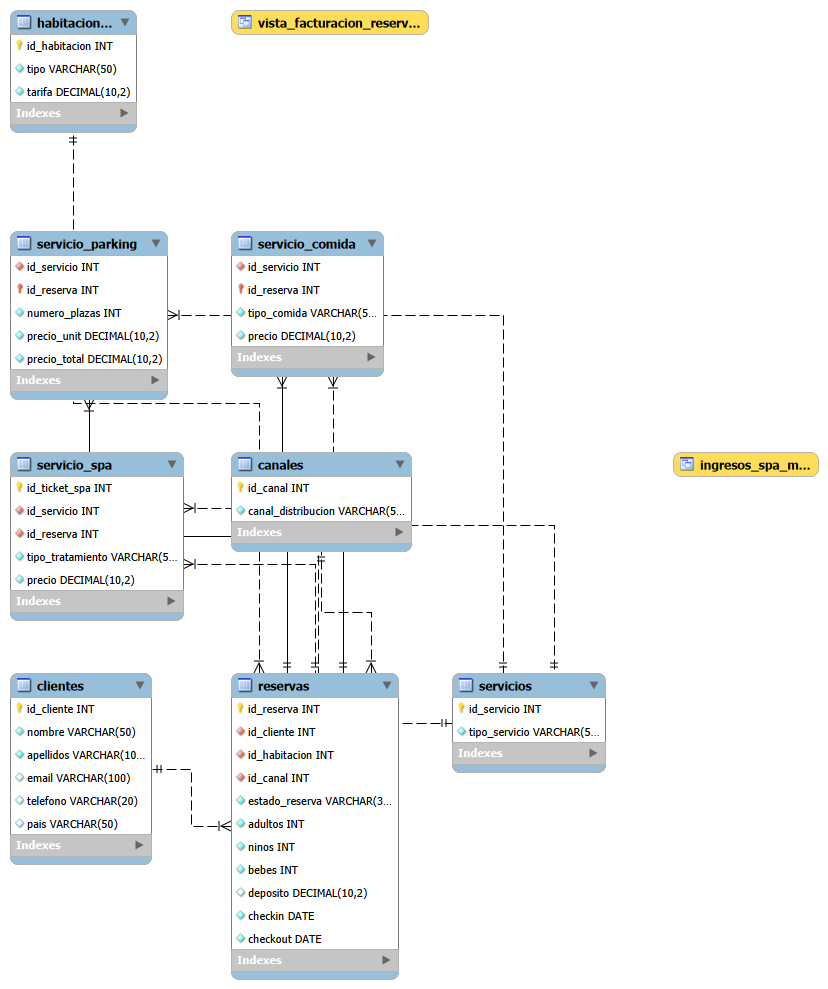

# 🏨 SQL_Resort_Relational_Database_EDA

Este proyecto se centra en el diseño y la implementación de una base de datos relacional para la gestión de un resort hotelero, incluyendo la automatización de cálculos de facturación y análisis de datos de servicios.


## 📂 Estructura del Repositorio
```
/
├── data/                       # Datos originales y transformados
│
├── 01_schema                   # Diseño de la base de datos
│
├── 02_data                     # Inserción de datos
│ 
├── 03_eda                      # Creación de querys, vistas y funciones
│
├── .gitignore                  # Archivo que indica qué elementos debe ignorar Git
│
├── README.md                   # Documentación principal del repositorio
│
├── modelo_esquema.png          # Imagen esquemática de la base de datos relacional
│
└── proyecto_hotel.mwb          # Modelo Entidad-Relación (Diseño visual en MySQL Workbench) 
```

## 📊 Diagrama de la Base de Datos (EER)



## 🚀 Funcionalidades Principales
Se han implementa soluciones avanzadas para la toma de decisiones estratégicas, destacando las siguientes funcionalidades:

**1. Análisis de Segmentación y Comportamiento del Huésped**
- **Identificación de Perfiles Dominantes:** clasificación de clientes (Individual, Pareja, Familia, Grupo) mediante lógica de composición de reserva.

- **Cálculo de Estancia Media:** análisis de la duración de las estancias para identificar nichos de mercado como el Day Use (0 días) y perfiles residenciales (60 días).

- **Fidelización Invertida:** monitorización de categorías (Plata, Oro, Diamante) para detectar anomalías en la pirámide de lealtad y prever la renovación generacional de la clientela.

**2. Control Financiero y Optimización de Ingresos**
- **Facturación Detallada:** creación de una Vista de Facturación que centraliza ingresos por alojamiento y servicios extra (Spa, Restaurante).

- **Función de Análisis Temporal:** implementación de una UDF (User Defined Function) para extraer la facturación mensual y anual, facilitando la auditoría de periodos específicos (ej. Agosto 2015).

- **Métrica de Valor de Cliente (CLV):** cálculo del gasto acumulado por usuario para identificar a los clientes de alta rentabilidad.

**3. Gestión de Riesgos y Estacionalidad**
- **Volatilidad de canales:** análisis del Ratio de Cancelación para identificar qué fuentes de reserva (Agencias, Web, Directo) presentan mayor riesgo operativo al comparar estados de Canceled frente a Check-Out.

- **Monitorización de Cancelaciones:** identificación de patrones de cancelación por segmento y detección de clientes con alta recurrencia de cancelaciones.

- **Análisis de Estacionalidad:** consultas para determinar los picos de demanda (Primavera), permitiendo una planificación eficiente de personal y mantenimiento.

- **Estrategias de Upselling:** análisis de inventario de habitaciones para fomentar el paso de habitaciones Dobles Interiores a Exteriores basándose en la rentabilidad por categoría.


## 🛠️ Tecnologías Utilizadas
* **MySQL / MySQL Workbench:** para el diseño del modelo EER y la creación de la base de datos.
* **SQL:** implementación de funciones, triggers y consultas complejas (HAVING, GROUP BY, JOINs).
* **Python (Jupyter Notebooks):** para la limpieza y comprobación inicial de los datos de entrada. También se ha usado para la creación de algunas columnas de la base de datos.
* **Excel:** para la creación de la tabla 'Spa'.

     